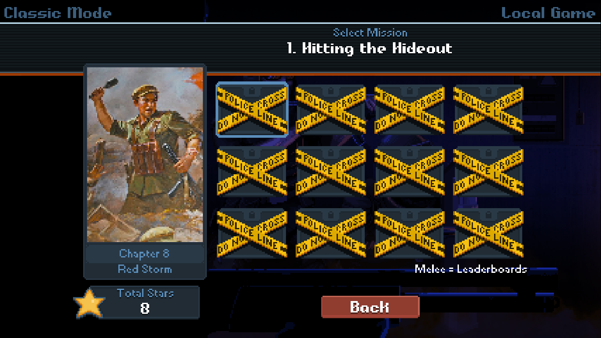

# FAQs

### How do I reverse this?

Just delete the symlink named `mod` from here:

	GAME_FOLDER\media\levels\missions\mods

It will only delete the symlink. It will leave the folder the symlink points to alone.

### My levels don't show up

If every level is blocked with police tape, like the screenshot below, then you haven't performed the setup to add the symlink (or the symlink setup didn't work, or the symlink has since been deleted).

### Should I use the batch script or make the symlink manually?

I advise using the batch script because it won't change anything unless several checks have passed. You can do it manually if you know exactly what you're doing ([instructions here](symlink-manual.md)).

### What's a symlink?

It's short for "symbolic directory link". They're a bit like shortcuts, but Windows treats them like proper folders, as if you had copy and pasted an entire folder from one place to the other.

They're basically portals ;)

### Why is a symlink needed?

The mod uses a symlink because, normally, the game can only read files from its own folders. The symlink lets it also read files from the folder that contains all the game's subscribed mods.

### Why not just package up all the levels?

Becuase that's not fair to the level creators, they made these levels. This mod just lets you use them in the main game, and track your stars.

Plus, the level makers can update their levels if they want to, and you'll always be able to play the latest version of their levels. It just works automatically.

### What files does this mod read?

You can see the list of files by viewing the `missions.xml` file for this mod on Github [here](https://github.com/ithinkandicode/door-kickers-action-squad-mods/blob/master/MODS/_LEVELS/Level%20Pack/mod_root/media/levels/missions/missions.xml).

At the end you'll see the list of levels it can load.

### What does the batch script (.bat file) do?

You can see examples of what the batch file does in the file [validation.md](validation.md) and in [this video](https://youtu.be/2Wdphu0VGEc).

Most of the batch script is validation, to make sure gamers have put the file in the right place (so nothing is changed where it shouldn't be), and are running it as an administrator (because the "mklink" command is a system tool so needs admin rights).

The actual change to the computer is made in the line that starts with mklink. This makes a type of shortcut called a symlink. Windows treats these as if they are identical to the folder they link to.

It won't impact your computer in any way, and you can delete the symlink that's created whenevr you want, with no bad side effects.

### Can you add any more episods?

Unfortunately not, the game has a limit of 9 episodes. If you add any more the game will crash.

### What does %LocalAppData% mean?

It's a shortcut to this folder:

	C:\Users\YOUR_USERNAME\AppData\Local

AppData is used for all sorts. For games it's mostly save files, like how Windows used to save everything to "My Documents". Most programs use AppData now.
