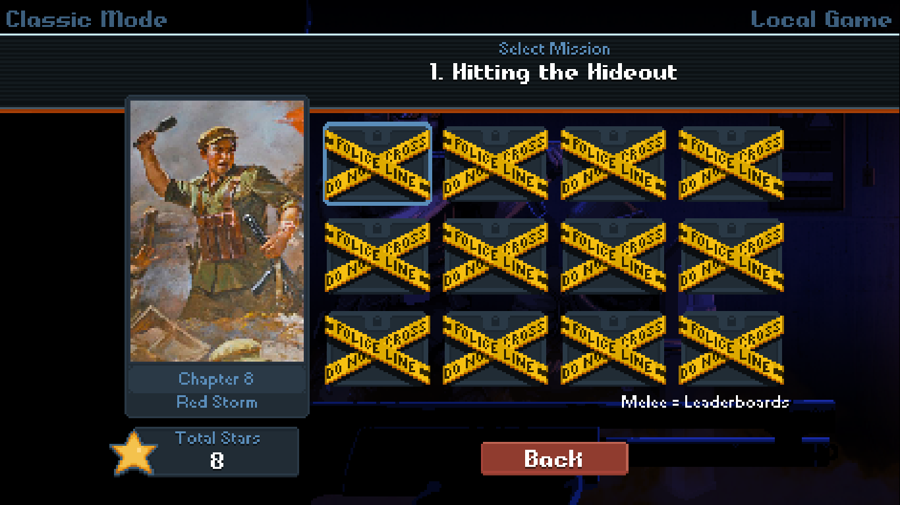

# Symlink Guide

A guide on manually creating the symlink this mod needs to work. I recommend using the bat file, because it tells you if anything is wrong ([examples](validation.md)). but the manual way is fine if you're confortable with the command prompt.

### Check AppData folder

First, check that this folder path works by going to Start Menu > Run > Paste the path > hit enter

	%LocalAppData%\KillHouseGames\ActionSquad\mods

This should open the folder where your subscribed DK:AS mods are stored. It will be full of folders with numbers, each folder is a different mod.

The symlink we're making here will let us access everything in that folder.

You can close the folder now. We just needed to make sure it's there.

### Find the game folder

In Steam, either right-click the game in the left side ist, or if you're viewing the game already, click the cog icon to the far right of the Play button.

Then choose Manage > Browse local game files. This will open the game folder. Copy the folder path.

### Open the command prompt

Open the Command Prompt as an __administrator__:

- Open the start menu
- Type `command prompt`
- Right-click "Command Prompt" and click "Run as administrator"

### Change to the game directory

Change directory to the game folder with `cd`:

	cd GAME_FOLDER

If your games are stored on a separate hard drive, you'll need to use the `/d` switch, which lets you change drives:

	cd /d GAME_FOLDER

You should now see the command prompt set to the game folder.

### Run the symlink command

Making sure you're currently in the game folder, enter this command:

mklink /d media\levels\missions\mods "%LocalAppData%\KillHouseGames\ActionSquad\mods"

You should see a message that looks like this:

	symbolic link created for GAME_FOLDER\media\levels\missions\mods <<===>> C:\Users\USERNAME\AppData\Local\KillHouseGames\ActionSquad\mods

Check that it's worked by going to the game folder, then media > levels > mission. There should be what looks like a shortcut, named "mod". Double-click it, and it should take you to the mods folder.

## FAQs

### What does %LocalAppData% mean?

It's a shortcut to this folder:

	C:\Users\YOUR_USERNAME\AppData\Local

AppData is used for all sorts. For games it's mostly save files, like how Windows used to save everything to "My Documents". Most programs use AppData now.

### My levels don't show up

If every level is blocked with police tape, like the screenshot below, then you haven't performed the setup to add the symlink (or the symlink setup didn't work, or the symlink has since been deleted).

