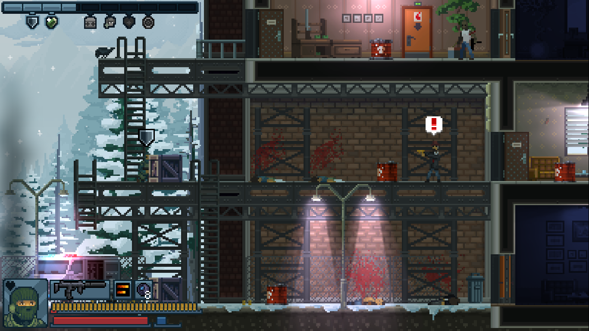

# Tips

## General

The perk trees can help you understand how to use each class best.

You can shoot while jumping.

When walking through doorways to other parts of the level, you can quickly peek then leave again. This gives you visibility on the room, makes the enemies start moving, and with some guns, gives you enough time to pop a few shots before retaliation.

It's always OK to resort to Breacher. He can help you learn level layouts.

Pro tip: don't save all the hostages right away. I always make sure not to overflow my Strategic Ability Bar.
https://steamcommunity.com/app/686200/discussions/0/1697169163416961278/#c3211505894108494690

If you buy everything and 3-star every level, you wil still have 3 stars left over.

### Enemies

Fat blue detonator guys: Always double tap. Crouch down and shoot them before they get the last laugh.

Hostage takers in hats can be kicked.

Hostage takers in red masks are assholes.

Elevators can squish, even bosses.

### Armor

Aimed Shot always has 5 AP, the highest AP possible. It kills most armoured enemies on 1 shot.

Even armoured enemies (the ones who shoot at kicked doors) will eventually wander. Learn their timing and you can use it against them, even if you can't see them.

### Gear

Gear can be used on ladders. You can things directly below you by holding DOWN and pressing USE.

Breaching Charges are powerful. They stick to everything.

## Assaulter

To use the MCX300, fire one shot at a time. The high recoil recovery lets you land another single shot swiftly, and unlike the M4A1, there's no damage dropoff after a short distance.

Notes on the MCX:

	The idea behind this gun is, compared to the M4A1, it doesn't suffer from damage dropoff at range (M4A1 STK goes from 2 to 3 after a short distance), and it has incredibly fast recoil recovery.

	This means, if you fire one shot at a time (vs. 2-round-burst with the M4), both shots will land at a long range.

	I think most players find it easier to just fire 3 shots with the M4, and suffer the recoil.

	Personally I've grown to like the MCX after learning how to use it, but the recoil has definitely got me killed a few times!

## Shield

How Shield Brace works:

https://steamcommunity.com/app/686200/discussions/0/1640927348826249701/#c1640927858844543044

Iron Maid:

https://steamcommunity.com/app/686200/discussions/0/3317353727677377666/?ctp=2#c1743346190276735290

## Agent Fergie

With early pistols, you can spam the fire button to sacrifice accuracy for DPS.

Agent excels with Breach Charges. Her knife can draw attention to normal doors. Her explosive skill buff is powerful.

Against armor, roll in close with and lay waste with Agent's , or take the bad guys out like a pro with her Revolver's new fast Aimed Shot.

The G18C Auto Pistol is expensive and innacurate, but makes up for this with a huge DPS. It also has some armor piercing.

Rolling blocks 50% of damage, or 65% with Agen't Tactics perk.
[src](https://steamcommunity.com/app/686200/discussions/0/3183345000083186460/?ctp=14#c1696046342868246863)

## Recon

Enemies will always beat Recon's low DPS, so play slow, learn their patterns, and outsmart them.

Get the first perk on his second branch first. It really makes up for that DPS gap.

Know when to use normal fire vs. Rapid Fire. Normal fire is good for close-quarters: If you're close enough to land all your shots, use it. For distance, use Rapid Fire. Rapid Fire deals less DPS, but higher damage per-shot, high range, and excellent accuracy. It's perfect for keping hostages alive.

### Guns

- MP9: A fine starter gun. Normal shots have the highest DPS in class. Weak rapid fire. Very weak AP (1).
- UZI SMG: Massive DPS, with a 5-STK. Highest rapid fire DPS (4 STK). Very weak AP (1).

### Gear

Cam Balls trigger as soon as they hit the ground.

Smoke and Flashbangs give you time to lay down Rapid Fire shots.

### Ultimates

The Silenced Shotgun is a beast in the early levels.

The Marksman Rifle is versatile and powerful:

- You can shoot at an angle (roughly 120deg), letting you fire at enemies from above them (eg. 3.5).
- You can select your target with alt fire. The back enemy is always targetted first. This is a _huge help_ against the fat blue detonator guys.
- It deals more damage the longer you aim for (watch the crosshair change). Against unarmoured enemies, you only need to wait a split second for a 1-STK.

### Skills

Skill perks really make this class.

Accuracy:

- Deal more damage and prevent retaliation.
- The last perk, Surgeon Precision, guarantees crits (+33% damage) on targetted enemies. This gives a huge DPS boost, and saves you points in the Recon tree (which raises team damage against targetted enemies).

Recon:

- Perk 1: Invisible - Gives you enough time to pop a Cam Ball and plan your attack.
- Perk 2: Duracells - Keeps highlights active for longer. Good for slower ranged shots with Rapid Fire.
- Perk 3: Rescue Plan - _Doubles_ hostage health.

Tactics:

- Perk 4: Caught In The Act - Doesn't make you invisible to enemies while in cover ─ but they'll have to get really close to spot you (a dsistance of about two wooden crates).

### Armor

Against armor, try the CBJ. It's loud, but it's massive 4 AP shreds armor (with the highest AP bar Aimed Shot). It's DPS is slightly lower than the MP7 due to MP7's higher fire rate (195 vs. MP7's 230), it's STK is actually lower (6 vs 7) with the same clip size (30), giving you more shoots between reloads.

### Appendix

Screenshots showing Recon's Caught In The Act skill.

Normal aware distance:

Skill perk distance:

## ODG

Garand can breach!
