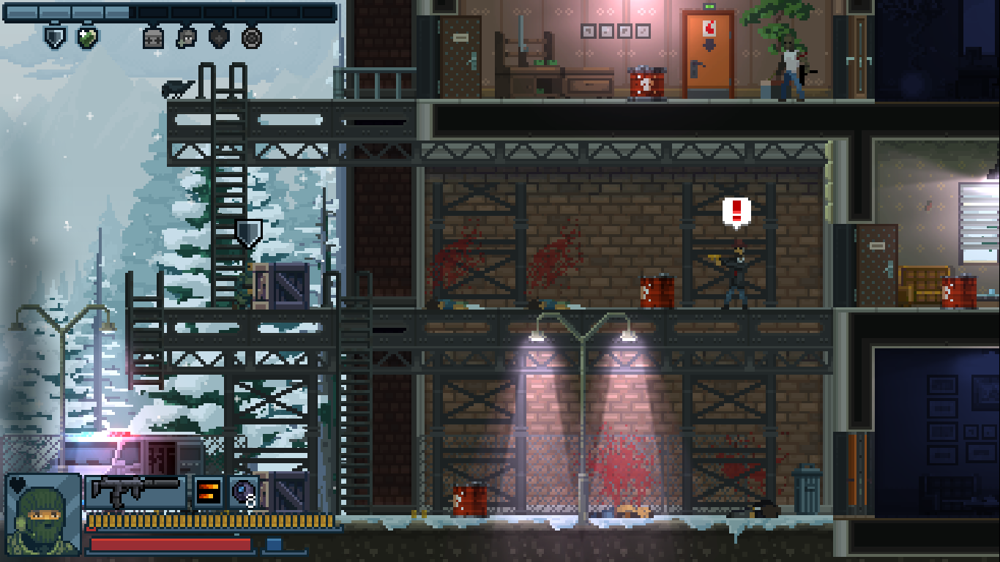

# Recon

## SMG Stats

| Name           | DPS |RF DPS |  TTK | RF TTK | STK | STK RF | Clip | Reload | AP  | Sound |
| ---------------| ---:|------:|  ---:| ------:|----:| ------:| ----:| ------:| ---:| -----:|
| MP9 Suppressed | 280 |   160 |  .38 |    .66 |   7 |      6 |   25 |   1.65 |   1 |    64 |
| UZI SMG        | 220 |   200 |  .45 |    .50 |   5 |      4 |   25 |   1.5  |   1 |   240 |
| MP5 Suppressed | 170 |   100 |  .60 |     1s |   7 |      1 |   30 |   1.9  |   0 |    50 |
| MP7 Suppressed | 230 |   125 |  .46 |    .80 |   7 |      6 |   30 |   1.8  |   3 |    84 |
| CBJ-65 SMG     | 195 |   160 |  .51 |    .62 |   6 |      5 |   30 |   1.5  |   4 |   240 |

### Notes

DPS = Damage per second, RF = Rapid Fire, STK = Shots to kill (unarmored enemy).

Accuracy is pretty similar. Close quarters, DPS is more important. At range, Recon's last two guns have almost perfect accuracy for his Rapid Fire.

Recoil controls how long you can fire for before your shots veer off. Recon can lay down sustained fire by firing his main shot for a few rounds, swtching to Rapid Fre, and repeat.

The big outlier for recoil is the UZI. Very low STK, but your recoil will be crazy after 5 sustained shots.

All STKs for RF are 1 less than normal shot STK.

Move speed reduction is always -20% while shooting.

MP5 is the outlier across the board. Low DPS, low STK, long reload, no AP. It has Aimed Shot, but once you get good with Recon you'll find his Rapid Fire is just as effective. But it's very quiet.

## Skills

Recon's top row skills are all great, except Crippling Shots which doesn't proc very often. Surgeon Precision is a game changer.

In his middle row, Invisible is a must-have, it offsets his initially low DPS and gives you time to deploy a cam ball. Duracells is really helpful too. Rescue Plan gives hostages about 50% extra HP, which is great in certain missions.

His bottom skills are fine, Double Tools is excellent. The cover hiding one is situational but is a lot of fun. Enemies have to be very close to spot you, see below.

## Caught in the Act

Screenshots of the distance difference with the "Caught in the Act" skill.

